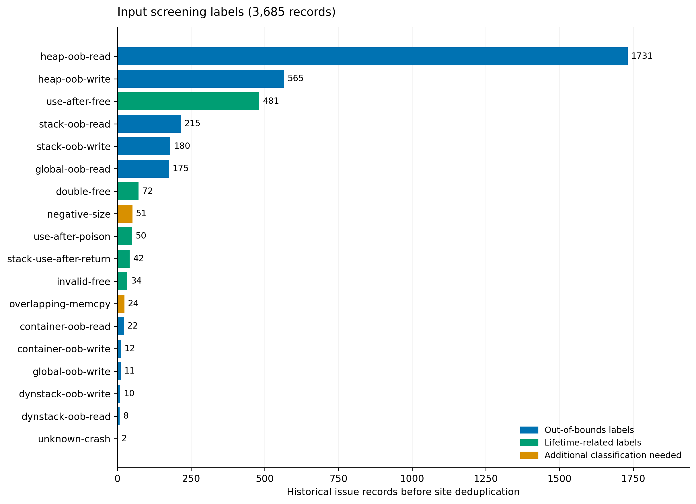

# 补充材料 S1　统计契约与记录审计

本材料对应修订正文的四项标准。目录与材料链取自 2026-09-16 元数据；计分身份以最终入口复验的五元组为准（2026-09-17 批次 19 单元，2026-09-18 arrow 批次替换 librawspeed）。20 个测试单元已准入，共 292 个五元组计分项（预期 287、额外 5）。目录中另有 290 个预期关联组，其组成与最终计分项不同。

## S1.1 统计单位与字段

| 名称 | 来源 | 可支持的解释 | 不能据此推出 |
|---|---|---|---|
| 问题记录 | census 的一条历史问题 | 预筛候选规模 | 独立漏洞数 |
| 候选位点键 | 项目命名空间内 site_key | 减少同位点候选重复 | 根因等价 |
| 观测行 | observations 的一条记录 | 保存的某次结果及解释 | 独立重复次数或实际执行总数 |
| 目录关联组 | summary.unique_expected_count | 原人工记录的去重计数 | 已完成本次独立根因审核 |
| 额外报告组 | summary.known_real_unique_count | 原记录在目录关联集合外另列的组 | 新漏洞或已审核的严格内存错误 |
| 检查输入 | aggregation.verified_expected | 最终接口检查集合的大小 | 聚合前已核验缺陷并集 |
| 匹配输入 | aggregation.verified_expected_matched | 在原记录规则下匹配的输入数 | 新增缺陷数量 |
| 选定状态 | benchmark_seat | 当前构建集合的成员 | 最终准入或性能评测资格 |

## S1.2 37 个有人工记录的项目

下表完整披露已记录项目。`未选定`仅表示不在当前 20 项集合中，具体原因见原 JSON；它不是统一失败类型。原 summary 合计含额外组，按既有字段原样显示。

表 S1　有人工记录的项目及当前构建状态。

| 项目 | 目录关联组 | 额外组 | 原记录合计 | 当前状态 | 版本来源 |
|---|---:|---:|---:|---|---|
| PcapPlusPlus | 18 | 0 | 18 | 选定 | `measured_sweep` |
| arrow | 7 | 1 | 8 | 选定（2026-09-18 复席） | `wave_eve` |
| assimp | 26 | 0 | 26 | 选定 | `measured_sweep` |
| binutils-gdb | 10 | 0 | 10 | 未选定 | `wave_eve` |
| c-blosc2 | 2 | 0 | 2 | 未选定 | `wave_eve` |
| espeak-ng | 10 | 0 | 10 | 选定 | `measured_sweep` |
| fluent-bit | 12 | 0 | 12 | 选定 | `wave_eve` |
| ghostpdl | 34 | 1 | 35 | 选定 | `wave_eve` |
| gpac | 27 | 0 | 27 | 选定 | `wave_eve` |
| harfbuzz | 3 | 0 | 3 | 未选定 | `wave_eve` |
| hdf5 | 12 | 0 | 12 | 选定 | `measured_sweep` |
| hunspell | 5 | 2 | 7 | 未选定 | `measured_sweep` |
| lcms | 7 | 0 | 7 | 未选定 | `wave_eve` |
| libavc | 10 | 1 | 11 | 选定 | `measured_sweep` |
| libdwarf | 14 | 0 | 14 | 选定 | `wave_eve` |
| libjxl | 2 | 0 | 2 | 未选定 | `wave_eve` |
| libraw | 8 | 0 | 8 | 选定 | `wave_eve` |
| librawspeed | 8 | 0 | 8 | 已归档（2026-09-18 被替换） | `wave_eve` |
| libredwg | 3 | 0 | 3 | 未选定 | `wave_eve` |
| libxml2 | 9 | 0 | 9 | 选定 | `wave_eve` |
| lwan | 8 | 0 | 8 | 已归档 | `wave_eve` |
| mruby | 2 | 0 | 2 | 未选定 | `wave_eve` |
| mupdf | 3 | 0 | 3 | 未选定 | `wave_eve` |
| ndpi | 15 | 0 | 15 | 选定 | `wave_eve` |
| open62541 | 2 | 0 | 2 | 未选定 | `wave_eve` |
| openh264 | 12 | 2 | 14 | 选定 | `measured_sweep` |
| opensc | 15 | 0 | 15 | 选定 | `wave_eve` |
| openthread | 4 | 0 | 4 | 未选定 | `wave_eve` |
| openvswitch | 12 | 0 | 12 | 选定 | `wave_eve` |
| pcl | 12 | 0 | 12 | 选定 | `measured_sweep` |
| pcre2 | 4 | 0 | 4 | 未选定 | `wave_eve` |
| php-src | 6 | 0 | 6 | 未选定 | `wave_eve` |
| radare2 | 3 | 0 | 3 | 未选定 | `wave_eve` |
| selinux | 13 | 0 | 13 | 选定 | `measured_sweep` |
| serenity | 4 | 0 | 4 | 未选定 | `wave_eve` |
| sleuthkit | 11 | 0 | 11 | 选定 | `wave_eve` |
| upx | 13 | 0 | 13 | 选定 | `measured_sweep` |

在 17 个未纳入当前集合的已记录项目中，按原 summary 合计有 11 个少于 6 组，3 个为 6–7 组，3 个至少 8 组。最后三者为 lwan、librawspeed 和 binutils-gdb：lwan 归档原因是入口文法异质，librawspeed 最终入口唯一五元组为 7（6–7 暂缓带，2026-09-18 被 arrow 替换），binutils-gdb 记录排除原因为入口集合分散。仅凭数量门槛无法重建全部选集决定。未记录的候选项目不计为构建失败。

## S1.3 去掉额外报告组的敏感性分析

仅在固定 20 项集合内改变计数口径，290 个目录关联组的每项目均值为 14.5、中位数为 12.5、范围为 7–34。剔除五个额外组不改变任何项目在门槛 8 下的数量达标状态。这不证明目录关联组的根因身份或类型已全部通过审核。

| 数量门槛 | 仅目录关联组达到门槛的项目 | 含额外组达到门槛的项目 |
|---:|---:|---:|
| 8 | 20 | 20 |
| 10 | 17 | 17 |
| 12 | 14 | 14 |
| 15 | 6 | 6 |
| 20 | 3 | 3 |

9 个 identity 项目记录 140 个目录关联组，11 个 prefix 项目记录 151 个目录关联组。两组项目并未随机分配，也不是同项目的前后对照，不用于估计聚合的因果收益。

## S1.4 字段完整性审计

逐项结果保存于 `evidence/field_audit.csv`，统计及规则保存于 `evidence/lightweight_analysis.json`。检查只验证字段非空、哈希字符串形式与记录文字，不打开镜像、不重新散列二进制、不测试实际覆盖。

20 项均有 40 位十六进制源码提交、最终镜像归档 SHA-256、非空路由映射及检查/匹配计数。20 项的 aggregation 同时含二进制与入口源码 SHA-256；hdf5 两项由聚合镜像内 `/out/h5_agg_fuzzer` 与 `/work/agg/h5_agg_fuzzer.c` 补记，并在2026-09-17复验前核对。对已知漏洞计数，还要求镜像可加载且纳入PoC可复验；完整构建配方另列。

核心覆盖说明按明确文字划分。fluent-bit 提及 library 与 plugins，libxml2 提及 library 与相关模块，librawspeed 提及 decoder/parser cores。其余 17 项在该字段下无法建立核心反馈证据，并非判定它们全部未插桩。三项明确说明也不等于已完成运行时反馈验证。

## S1.5 方法实现锚点

候选位点代表按问题 ID 递增保留首项，见 `memvul/catalog.py::group_project`。提交时间取 Git committer timestamp `%ct`，见 `memvul/gitutil.py::commit_date`。波次按 UTC 日分组，同日按时间戳与问题 ID 排序。候选取最早修复的第一父提交，见 `memvul/gitutil.py::parent` 与 `memvul/candidates.py::resolve_eves`。评分只遍历可解析修复，祖先判断采用 Git 提交图。730 天是固定工程窗口，未做参数最优性验证。

20 项中目录版本来源为 11 项 wave_eve、9 项 measured_sweep。因此正文把修复波次描述为候选提议机制，不把全部选定项目归因于该启发式的独立成功。候选脚本中的历史字段名 n_latent_upper 不能被解释成具有数学保证的实际漏洞上界。

原 45 项数据来源哈希保留于 `evidence/source_manifest.json`，此次额外阅读的两份方法实现哈希另列于 `evidence/method_source_manifest.json`。

## S1.6 输入层类型分布

图 S1　3,685 条 core 预筛问题记录的标签分布。分母是历史输入记录，未按最终缺陷组去重。颜色仅区分明显的越界标签、生命周期相关标签与需额外判定的候选标签，不代表逐条审核后的严格类型。negative-size、overlapping-memcpy 与 unknown-crash 共 77 条单独标示，避免读者将全部预筛项视为空间/时效漏洞。

## S1.7 配置实例与输入路由账本

提供 hdf5（prefix）与 assimp（identity）的原配置字段摘录，位于 `evidence/configuration_examples/`。这些是历史字段原样摘录，不是本轮复建或源码无修改证明。路径可定位作者工作区材料，但外部读者仍需要归档及依赖。hdf5 的原构建命令存在 `<ASan flags>` 占位表示，不能当作已完全自包含的构建配方。两实例的源码差异状态均未在本轮验证。

下表展示 hdf5 的12条 expected 观测怎样分布到两个原入口，以及记录的最终接口映射。路由来自 aggregation.mapping；选择字节是根据既有取模协议推导的规范值，未声称重新生成或回放了输入。表中是历史问题 ID，而非本轮新建的稳定组 ID。对应观测原字段可在 observation_register.json 定位。

| 历史问题 ID | 原始入口 | 规范选择字节 | 原记录日志 | 最终接口逐条材料 |
|---|---|---|---|---|
| 42520218 | `h5_read_fuzzer` | `0` | `42520218.log` | 路由0；聚合PoC `pocs/agg/42520218`；原日志在；聚合日志未记录 |
| 42521522 | `h5_read_fuzzer` | `0` | `42521522.log` | 路由0；聚合PoC `pocs/agg/42521522`；原日志在；聚合日志未记录 |
| 42521342 | `h5_extended_fuzzer` | `1` | `42521342-h5-extended.log` | 路由1；聚合PoC在；原日志在；聚合日志未记录 |
| 42522531 | `h5_extended_fuzzer` | `1` | `42522531-h5-extended.log` | 路由1；聚合PoC在；原日志在；聚合日志未记录 |
| 42523860 | `h5_extended_fuzzer` | `1` | `42523860-h5-extended.log` | 路由1；聚合PoC在；原日志在；聚合日志未记录 |
| 42524740 | `h5_extended_fuzzer` | `1` | `42524740-h5-extended.log` | 路由1；聚合PoC在；原日志在；聚合日志未记录 |
| 42525184 | `h5_extended_fuzzer` | `1` | `42525184-h5-extended.log` | 路由1；聚合PoC在；原日志在；聚合日志未记录 |
| 42527526 | `h5_extended_fuzzer` | `1` | `42527526-h5-extended.log` | 路由1；聚合PoC在；原日志在；聚合日志未记录 |
| 42527895 | `h5_extended_fuzzer` | `1` | `42527895-h5-extended.log` | 路由1；聚合PoC在；原日志在；聚合日志未记录 |
| 42530550 | `h5_extended_fuzzer` | `1` | `42530550-h5-extended.log` | 路由1；聚合PoC在；原日志在；聚合日志未记录 |
| 42534125 | `h5_extended_fuzzer` | `1` | `42534125-h5-extended.log` | 路由1；聚合PoC在；原日志在；聚合日志未记录 |
| 42534222 | `h5_extended_fuzzer` | `1` | `42534222-h5-extended.log` | 路由1；聚合PoC在；原日志在；聚合日志未记录 |

这 12 条观测中 2 条来自 h5_read_fuzzer，10 条来自 h5_extended_fuzzer。记录层关联键给出原入口候选数 10 和目录并集 12，summary 记 12 个目录关联组，aggregation 记 12/12 输入匹配。表中是历史问题 ID 与 2026-09-16 记录路径，不是最终计分 ID。随后 2026-09-17 的最终入口复验得到 12 个五元组；原入口未按相同身份规则独立复验，因此不报告已核验的聚合净增益。20 个单元的同类记录转录见 `evidence/material_chain.json`。

跨输入身份归并可对照正文的libavc实例。42530559 与 42530568 在最终入口复验上得到同一五元组 `null-deref|READ|isvcd_parse_epslice.c|1908|6d2a20374698b2de`，合并为一个计分项。

## S1.8 拟发布逐组清单契约

测试单元U固定程序、版本和harness；F/S/U/T组成campaign配置，E单独关联。每个最终计分项须形成以下材料链，不能用项目级summary替代。

| 对象 | 最小字段与用途 |
|---|---|
| 计分身份与指纹 | 最终入口上的五元组：类型、方向、文件、行号、最多三个项目帧的规范化哈希；历史 ID 只作来源。同一行不同 \(H_3\) 暂计为不同项，须保留根因复核可能 |
| 类型及成员关系 | U及固定版本、统一类型与原标签、S/E索引、最终harness与路由；用于核算单元内已知计分项数 |
| PoC与触发材料 | 一条或多条输入及哈希、命令、退出状态、实际报告和日志；只证明该指纹可被见证，不参与去重 |
| 编译与运行环境 | 可加载镜像、最终二进制哈希、可复验PoC；构建配方另存，不进入五元组计数 |
| 审核记录 | 审核人、日期、证据位置、冲突处理及状态；未明确项保留未知 |

计分身份就是该五元组，不能由观测序号、PoC 文件名、修复提交或 summary 计数生成。类型就是五元组中的错误类型。最终入口复验（2026-09-17 批次加 2026-09-18 arrow 批次，共 301 条输入、300 条故障报告）得到292个已核验五元组（`evidence/rereplay_fingerprint_ledger.json`）：293条expected观测落到287个，7条known_real观测落到5个。四元关联键是目录整理用的粗键。20个单元已准入且每单元不少于8项；librawspeed（7项）已于2026-09-18被arrow（7项expected＋1项经审计的额外项）替换。

表 S3　最终入口五元组与目录关联组。expected五元组是身份；目录组只作来源追溯。

| 项目 | 目录expected | 最终入口expected五元组 | 额外五元组 |
|---|---:|---:|---:|
| ghostpdl | 34 | 34 | 1 |
| gpac | 27 | 28 | 0 |
| assimp | 26 | 26 | 0 |
| PcapPlusPlus | 18 | 18 | 0 |
| ndpi | 15 | 15 | 0 |
| opensc | 15 | 15 | 0 |
| libdwarf | 14 | 14 | 0 |
| openh264 | 12 | 12 | 2 |
| selinux | 13 | 13 | 0 |
| upx | 13 | 14 | 0 |
| fluent-bit | 12 | 12 | 0 |
| hdf5 | 12 | 12 | 0 |
| openvswitch | 12 | 12 | 0 |
| pcl | 12 | 8 | 0 |
| libavc | 10 | 10 | 1 |
| sleuthkit | 11 | 11 | 0 |
| espeak-ng | 10 | 10 | 0 |
| libxml2 | 9 | 8 | 0 |
| libraw | 8 | 8 | 0 |
| arrow | 7 | 7 | 1 |
| 合计 | 290 | 287 | 5 |

`evidence/observation_register.json`原样导出2026-09-17审计时的621条观测并提供JSON Pointer，包含294条expected类观测；2026-09-18 arrow批次的27条观测见其manual记录，未重写该誊录。项目最终二进制哈希只作为已记录配置的索引并列保存，`final_configuration_membership`明确为尚未推断，不能用这个并列字段冒充某次观测运行了该二进制。

`evidence/material_chain.json` 是2026-09-17审计的记录层誊录，把当时20单元的294条expected观测连接到原入口、最终路由、目录字段和本地PoC／日志路径；四元重建的289个关联键与291个summary目录组之差全部来自libxml2（9条expected观测共享7个四元组）。294条均能定位至少一个PoC和一条日志；PcapPlusPlus与pcl缺原回放目录。该链未随2026-09-18替换重写：librawspeed的观测链保留作过程誊录，arrow的对应材料见其manual记录与`data/measure/rereplay/2026-09-18/`。关联键不是最终五元组。

CSV保留旧字段`recorded_expected_observations`以兼容已有读取者，其旧含义仅为expected_asan，现标为弃用别名。2026-09-18替换后选定集合的对应合计为`recorded_expected_asan_observations` 290、`recorded_expected_crash_observations` 3、`recorded_expected_total_observations` 293。这三列的语义与正文一致，不影响287个expected去重组。

## S1.9 候选探索与构建过程披露

本研究的目标集合规模为20个真实项目，每项目对外一个harness。下述数字记录材料探索和人工处理范围，不作为20这一目标规模的推导依据，也不是64项目穷尽核验后的总体通过率。保留这些数据用于说明选择偏差与来源，不将未处理项目等同于失败。

输入快照包含 6,138 条记录，其中 3,685 条被现有分类器标为 core，占 60.04%。满足仓库、修复提交及非子模块条件的 core 记录为 3,670 条。原有不带项目名的位点键去重得到 2,833 个键；将项目名纳入命名空间后得到 2,873 个项目内位点键。本文采用后者描述跨项目候选规模，同时保留前者以解释与既有 README 的差异。这一差异属于候选位点统计，不是对最终缺陷根因数量的新增核验。

按照每项目超过 10 个候选位点的规则，目录包含 64 个项目，其中 63 个具有可解析的候选版本。人工测量目录包含 37 个项目，当前选定集合包含 20 个项目。其余项目存在低计数、材料缺失、入口过于分散或尚未处理等不同情况，不能统一解释为构建失败。表 S2 汇总不同统计层次。

选定版本的来源并不完全相同。目录中 11 项标为 `wave_eve`，9 项标为 `measured_sweep`。后者反映历史人工测量选择，不能全部归因于本文的波次启发式；本稿未获得统一的人工尝试范围与停止规则，补充表保留这些缺口。在 17 个有记录但未选定的项目中，按原 summary 合计，11 项少于 6 组，3 项为 6–7 组，另有 3 项达到 8 组。达到数量门槛但未入选的 lwan、librawspeed 已归档（librawspeed 最终入口唯一五元组为 7，2026-09-18 被 arrow 替换），binutils-gdb 记录了入口分散的排除原因。因此，数量门槛是选择条件之一，不是完整的选集算法。全部 37 项及版本来源见补充材料 S1.2，20 项逐版本来源见 `version_provenance.csv`。

表 S2　输入与构建规模。

| 层次 | 数量 | 单位与含义 |
|---|---:|---|
| 原始快照 | 6,138 | ARVO 派生问题记录 |
| core 预筛 | 3,685 | 分类器选中的问题记录 |
| 元数据条件满足 | 3,670 | 可开展后续尝试，不表示构建成功 |
| 项目命名空间内位点去重 | 2,873 | `(project, site_key)`，不是根因漏洞数 |
| 候选项目目录 | 64 | 每项目候选位点超过 10 |
| 可解析候选版本 | 63 | 目录中的固定版本 |
| 有人工测量记录 | 37 | 已存在逐项目测量文件 |
| 当前选定目标 | 20 | 已按最终入口五元组准入 |

输入类型分布仅用于检查预筛范围，移至补充图 S1。它以历史问题记录为单位，不能代表最终组类型；其中负长度、重叠复制和未知崩溃等候选需要另行分类。正文的主要规模统计不使用该分布推断最终集合的空间/时效构成。

## S1.10 四项标准下的审计范围

正文第 2、4、5、7 节分别说明四项标准、构建方法、核验结果和证据边界；历史审查见 `revision-v4/gap-assessment.md`。`evidence/material_chain.json` 转录记录层材料链；`evidence/rereplay_fingerprint_ledger.json` 保存最终入口五元组；`data/measure/admission/2026-09-18.json` 记录现行准入（取代 2026-09-17）。最终准入计分项为 292 个，并不等同于 292 个已逐项证明独立的根因。C1以checkout为据，不要求核心diff；C4对计数只要求镜像可加载、二进制一致、PoC可复验。分类使用CWE术语的固定归并视图。难度、灵敏度和有效评估粒度不作为调查指标。
